# MC SMS Forwarder (Multi-Channel)

Listens for incoming SMS on an Android device, runs them through a sender/regex filter pipeline, and re-sends the matched body through any combination of three outbound channels:

- **WhatsApp** — via the [WhatsApp Cloud API](https://developers.facebook.com/docs/whatsapp/cloud-api/).
- **Telegram** — via the [Telegram Bot API](https://core.telegram.org/bots/api).
- **SMS** — re-sent from this device's own SIM via `SmsManager`.

Each channel is independently toggleable; enable one, two, or all three at once.

> **Test variant.** The WhatsApp access token and Telegram bot token are stored **encrypted at rest** (AES/GCM using a key held by Android Keystore, separate from the app's plaintext `SharedPreferences`) and are **write-only** in the UI — once saved they are never re-displayed. The SMS channel needs no token — it uses the device modem. Even so, only install on a device you fully control, and use the narrowest credentials you can.

## Screenshots

| Status / readiness | Channels | Activity log |
| --- | --- | --- |
| 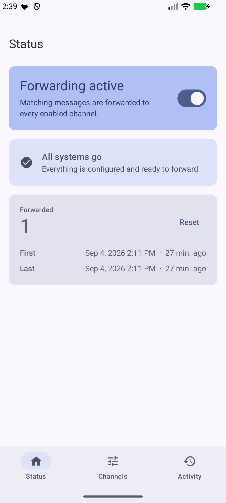 | 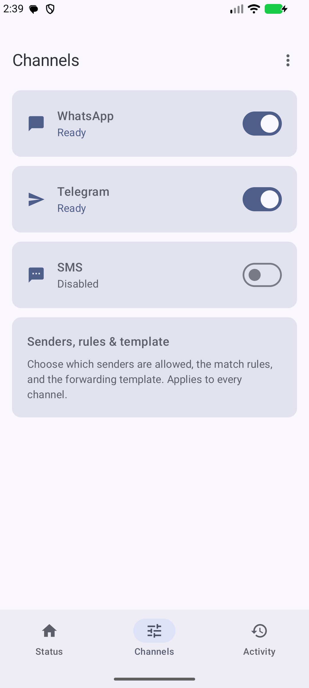 | 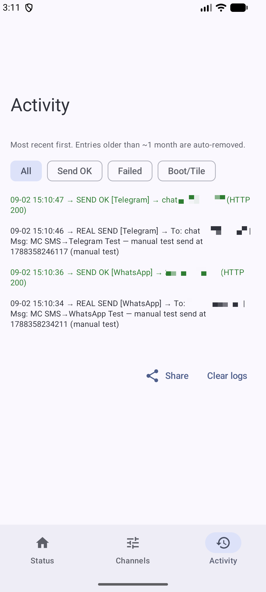 |

The UI is a single-activity Jetpack Compose app with a Material 3 bottom-navigation bar:

- **Status** — a master forwarding switch plus a **readiness checklist** that surfaces only the blocking setup items (permissions, battery exemption, missing credentials) as actionable fix chips, a lifetime forwarding-stats card, and a subdued build-information card. Each permission action requests only the permission named by its row; if Android blocks or denies the dialog, the screen offers a persistent **App settings** fallback. The battery action opens Android's package-specific confirmation; the user grants the exemption once and the app checks its current status thereafter.
- **Channels** — WhatsApp, Telegram, and SMS as cards (status + enable switch); tap one to open its detail form, or open **Senders, rules & template** for the shared filters.
- **Activity** — the log uses neutral send attempts, green successes, red failures, and amber filter rejections, with filter chips for each category.

| Channel detail (WhatsApp) | Sender rules | Filter-rejection diagnostic |
| --- | --- | --- |
| 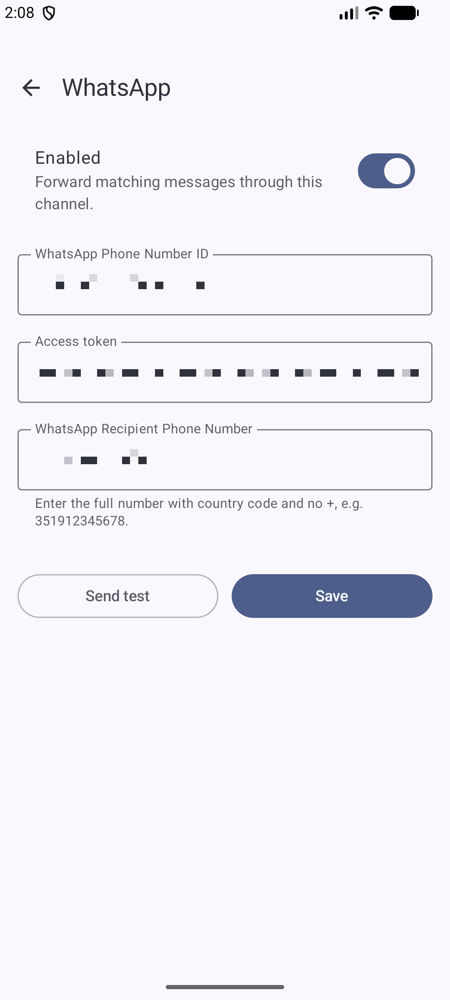 | 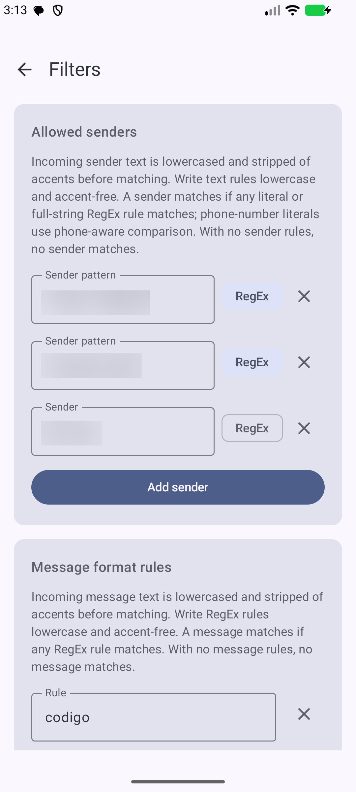 | 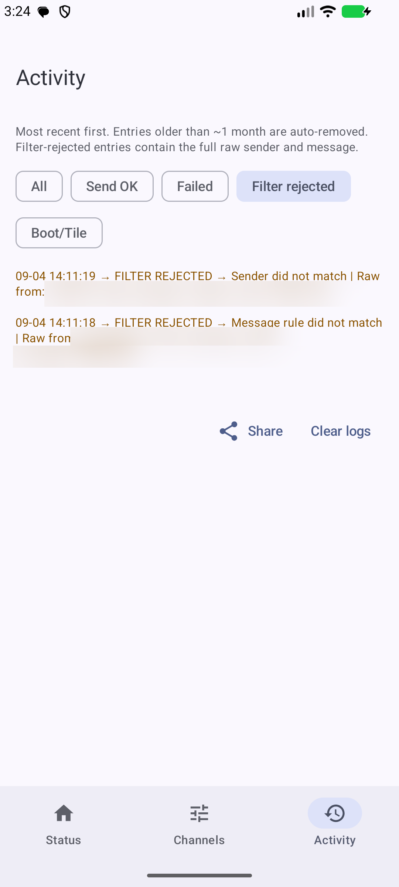 |

| Provisioning menu | Paste encrypted code | QR scanner |
| --- | --- | --- |
| 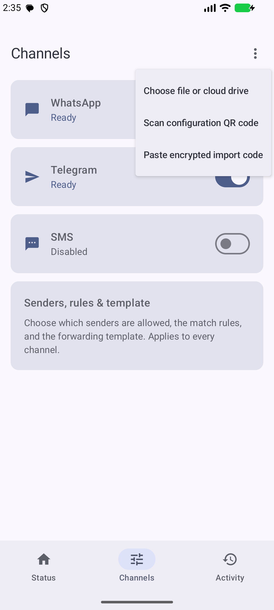 | 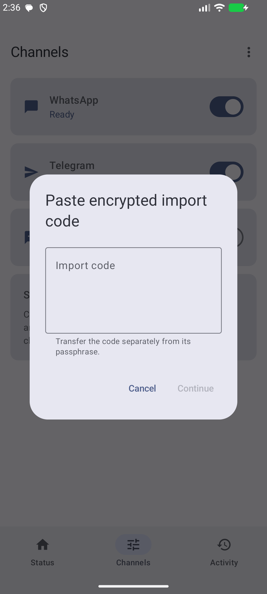 | 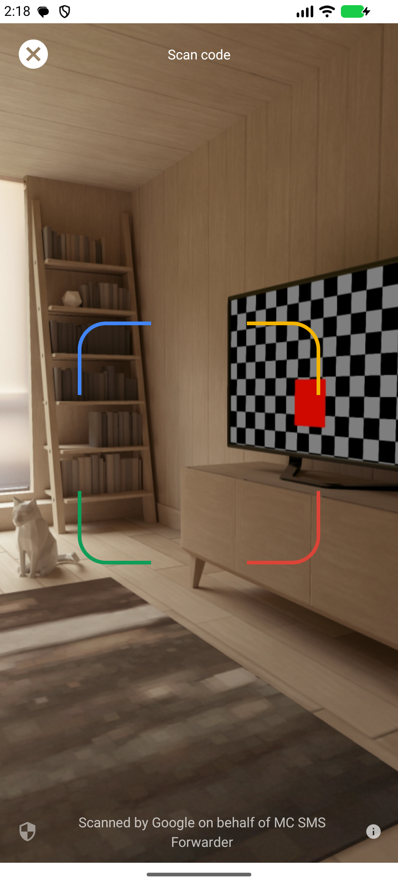 |

| Passphrase confirmation | Idempotent re-import |
| --- | --- |
| 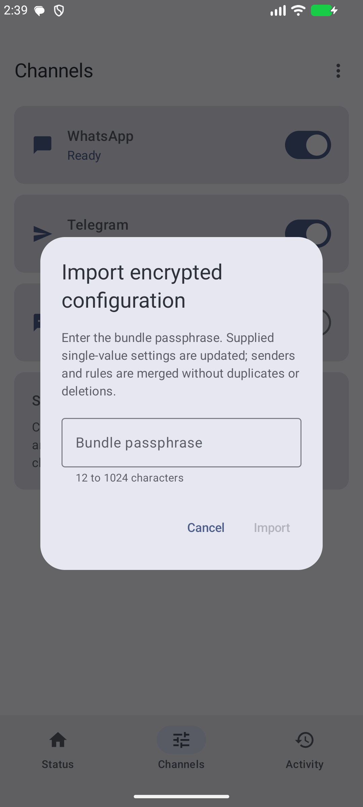 | 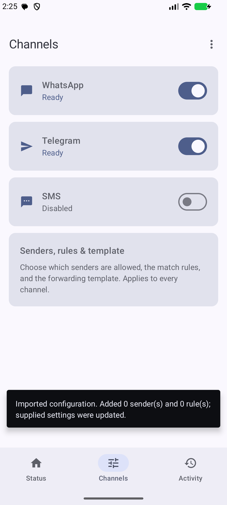 |

Sensitive credential, account, phone, sender, and message regions are irreversibly redacted in the
documentation images.

## What it does

- `BroadcastReceiver` listens to `SMS_RECEIVED`.
- Reassembles multipart messages.
- Drops everything unless the **master switch** is on.
- Suppresses any message that arrives from the **SMS forward destination** (loop guard, SMS channel only).
- Normalizes the body (NFD + strip combining marks + lowercase) and matches it against **any** configured regex. Regex source is not normalized, so rules must be lowercase and accent-free.
- Normalizes the raw sender the same way, then matches it against literal entries or full-string sender regexes exactly as entered. Textual sender rules must therefore be lowercase and accent-free; literal phone numbers retain `PhoneNumberUtils.areSamePhoneNumber`.
- Forwards only when both a sender rule and a message rule match.
- If exactly one component matches, records a **Filter rejected** activity entry containing the full raw sender and message plus the component that failed, then does not forward.
- If neither component matches, does nothing.
- Optionally re-formats the outgoing text with a template (`%s` = source, `%t` = time, `%m` = original message).
- Sends the result through **every operational channel** (toggle on AND credentials present):
  - **WhatsApp** — `POST https://graph.facebook.com/v21.0/{PHONE_NUMBER_ID}/messages` with a `Bearer` token, as an **approved template** message. The template name and language are fixed in code (the approved `titled_forwarded_sms` template); its body has two parameters — `{{1}}` is a fixed user name and `{{2}}` is the forwarded SMS body.
  - **Telegram** — `POST https://api.telegram.org/bot{TOKEN}/sendMessage` with `chat_id` + `text` (web previews disabled).
  - **SMS** — `SmsManager.sendMultipartTextMessage` to the configured destination number; per-segment modem results are surfaced in the activity log.

The reception, filtering, normalization, multipart handling, and template logic are shared by all channels.

> **Sensitive logs:** Filter-rejected entries intentionally retain the full raw sender and message
> for troubleshooting. They follow the normal 35-day/2,000-entry pruning policy and are included
> when you use **Share**, so clear or share the log accordingly.

## What is NOT included

- No retry / backoff queue. HTTP sends start concurrently so one slow request does not queue or reject another. Each uses an 8.5-second receiver-facing completion deadline; the underlying connection has 8-second connect/read safeguards and may finish later, in which case delivery is reported as unknown. The SMS channel reports the modem result asynchronously in the log. None of the channels retries.
- No webhook server for delivery receipts.
- No media (image/audio/document) forwarding — text only.
- **Loop guard is SMS-only.** A message arriving from the SMS forward destination is suppressed so an SMS→SMS echo cannot bounce indefinitely. WhatsApp and Telegram run on a different transport and cannot re-trigger the pipeline, so they need no guard.

## Build & install

Download the latest signed release directly from GitHub or from the [project website](https://miguelcaldasmsorg.github.io/MCSMSForwarderMultiChannel/):

- [MC.SMS.Forwarder.apk](https://github.com/MiguelCaldasMSOrg/MCSMSForwarderMultiChannel/releases/latest/download/MC.SMS.Forwarder.apk)
- [MC.SMS.Forwarder.apk.sha256](https://github.com/MiguelCaldasMSOrg/MCSMSForwarderMultiChannel/releases/latest/download/MC.SMS.Forwarder.apk.sha256)

Verify the downloaded APK on Windows:

```powershell
$expected = (Get-Content .\MC.SMS.Forwarder.apk.sha256).Split()[0]
$actual = (Get-FileHash .\MC.SMS.Forwarder.apk -Algorithm SHA256).Hash
$actual.Equals($expected, [StringComparison]::OrdinalIgnoreCase)
```

The command must return `True`. Android may also warn that the APK comes from outside an app store; only install a file whose checksum matches the published value.

### Local builds

```powershell
.\gradlew.bat :app:assembleDebug          # build debug APK
.\gradlew.bat :app:installDebug           # build + install on connected device/emulator
.\gradlew.bat :app:testDebugUnitTest       # run JVM unit tests
```

`compileSdk` 37, `minSdk` 33, `targetSdk` 36, built-in Kotlin 2.2.10, AGP 9.3.2, Gradle 9.5, Compose BOM 2026.08.00 (including Material 3), Navigation 2.10.0, and Google Code Scanner 16.1.0.

Release signing is opt-in via Gradle properties (`RELEASE_KEYSTORE_PATH`, `RELEASE_KEYSTORE_PASSWORD`, `RELEASE_KEY_ALIAS`, `RELEASE_KEY_PASSWORD`). No keystore is committed.

Each APK embeds its version, UTC build timestamp, and source revision for the **About** card
at the bottom of the Status screen. Local builds use the current time and Git `HEAD`; `-dirty` is
appended when the working tree has changes. Embedding the current time intentionally makes
otherwise identical builds differ. Reproducible builds can provide stable values:

```powershell
.\gradlew.bat :app:assembleRelease `
    -PBUILD_TIMESTAMP_EPOCH_MILLIS=1788539573000 `
    -PBUILD_SOURCE_REVISION=3ac2192d
```

The release workflow captures one timestamp immediately before its test/build invocation and uses
GitHub's checked-out commit SHA.

### Publishing a release

The [Publish release workflow](.github/workflows/publish-release.yml) runs when a version tag such as `v1.0.3` is pushed. Git tags use the conventional `v` prefix while Android `versionName` remains plain SemVer (`1.0.3`). The workflow strips the tag's leading `v`, verifies that both numeric versions match, and aborts before building if they do not. It then runs the JVM tests, builds and verifies the signed APK, generates its SHA-256 checksum, and publishes both files as native GitHub Release assets. The stable links above automatically follow the latest release.

Configure these encrypted repository secrets once under **Settings → Secrets and variables → Actions**:

| Secret | Value |
| --- | --- |
| `RELEASE_KEYSTORE_BASE64` | Base64 encoding of the release keystore file |
| `RELEASE_KEYSTORE_PASSWORD` | Keystore password |
| `RELEASE_KEY_ALIAS` | Signing key alias |
| `RELEASE_KEY_PASSWORD` | Signing key password |

The keystore must contain the same signing key as previous releases, otherwise Android will reject upgrades. To send its base64 representation directly to GitHub without creating another file:

```powershell
[Convert]::ToBase64String([IO.File]::ReadAllBytes("C:\path\to\release.jks")) | gh secret set RELEASE_KEYSTORE_BASE64
gh secret set RELEASE_KEYSTORE_PASSWORD
gh secret set RELEASE_KEY_ALIAS
gh secret set RELEASE_KEY_PASSWORD
```

The final three commands prompt securely for their values. Never put the keystore or passwords in the repository.

For each release, increment `versionCode` and set the no-prefix `versionName` in `app/build.gradle.kts`, then commit and push the change before creating the matching annotated `v`-prefixed tag. The tag's numeric part must exactly match `versionName`:

```powershell
git push origin master
git tag -a v1.0.3 -m "Release 1.0.3"
git push origin v1.0.3
```

The release is created only if all validation, tests, signing, and build steps succeed. Changes under `legal/` are independently deployed to GitHub Pages after a successful push to `master`; the website uses stable latest-release URLs, so it does not need a content update for every release.

## Encrypted configuration provisioning

The app's runtime configuration can be initialized without typing every value on the phone. The
single-file PowerShell 7 helper creates a passphrase-encrypted `.mcsmsconfig` bundle using
PBKDF2-HMAC-SHA256 and AES-256-GCM. It supports the master switch, all three channel forms, allowed
senders, regex rules, and the shared forwarding template:

```powershell
pwsh .\tools\New-ProvisioningBundle.ps1 `
    -OutputPath "$HOME\Downloads\mc-sms-forwarder.mcsmsconfig" `
    -QrCodePath "$HOME\Downloads\mc-sms-forwarder-qr.png"
```

The helper prompts for the included values and bundle passphrase; access tokens and the passphrase
are hidden. It refuses to write output inside this repository. The Channels overflow menu provides
three equivalent inputs:

- **Choose file or cloud drive** — Android's document picker can select local storage or an
  installed cloud provider.
- **Scan configuration QR code** — scan the helper's local QR from the computer screen. Google Play
  services processes the image on-device; the app does not request camera permission.
- **Paste encrypted import code** — add `-CopyImportCode` when running the helper, transfer the
  encrypted code separately from its passphrase, and paste it into the app.

All three routes ask for the same passphrase and use the same authenticated importer. QR generation
requires Node.js/npm; the helper runs the pinned `qrcode` 1.5.4 package locally and never submits
the code to a QR web service.

The importer decrypts and validates the bundle in memory. Tokens are immediately re-encrypted by
the app's Android Keystore-backed `SecureStore`; other supplied fields use the existing private
preferences. The app does not retain a copy of the source bundle or persistent access to it, and
imported values remain editable through the normal screens. Unknown or malformed settings reject
the complete import before it becomes active.

Provisioning is idempotent:

- Omitted settings remain unchanged.
- Supplied single-value settings replace their current value.
- Allowed senders and regex rules are additive. Existing entries are never removed or reordered,
  and a repeated import adds nothing.
- Sender duplicates are mode-aware: literal and RegEx forms remain distinct, exact rule text is
  deduplicated, and equivalent literal phone numbers are not added twice. Message-regex duplicates
  require exact text equality because whitespace and case can affect a pattern.

For non-interactive input, pass `-ConfigurationPath` with a JSON file using this shape:

```json
{
  "masterEnabled": true,
  "whatsApp": {
    "enabled": true,
    "phoneNumberId": "<phone-number-id>",
    "accessToken": "<access-token>",
    "recipient": "<recipient-number>"
  },
  "telegram": {
    "enabled": false,
    "botToken": "<bot-token>",
    "chatId": "<chat-id>"
  },
  "sms": {
    "enabled": false,
    "destination": "<sms-destination>"
  },
  "filters": {
    "allowedSenders": [
      {
        "value": "^chave.*digital$",
        "regex": true
      },
      {
        "value": "mb way",
        "regex": false
      }
    ],
    "regexes": [
      "<message-regex>",
      "<another-regex>"
    ],
    "forwardTemplate": "[%t] %s: %m"
  }
}
```

Every top-level section and every field inside `filters` is optional. If a channel section is
included, all of its displayed fields are required and credentials must be nonblank. Runtime
permissions, the battery-optimization exemption, activity logs, forwarding statistics, and
remembered dry-run test inputs are device/runtime state and are intentionally not provisioned.
Every `allowedSenders` entry must explicitly provide both `value` and `regex`.

Keep that plaintext file outside every Git checkout and delete it securely when it is no longer
needed. Treat the encrypted bundle as sensitive too, use a strong unique passphrase, keep it
separately, and never
commit either file. Android backup and device transfer deliberately exclude the encrypted secret
preferences because the corresponding Keystore key cannot be transferred.

## One-time Meta setup (WhatsApp)

The quickest development path is to use the **test phone number** Meta exposes in the App Dashboard. Test numbers and dashboard-managed test recipients are intended for development, not production-scale messaging. The custom `titled_forwarded_sms` template used by this app must still be approved for the connected WhatsApp Business Account.

### Click-path: developer test number with a system-user token

1. Sign in at <https://developers.facebook.com/> and create a **Business** app. From the app dashboard, add the **WhatsApp** product.
2. *WhatsApp → API Setup*: Meta auto-provisions a **WhatsApp Business Account (WABA)** and a **test phone number**. Copy the **Phone number ID** (numeric, under the test number).
3. Still in *API Setup*, under **To**, use **Manage phone number list** to add your WhatsApp number as a test recipient, then complete the verification flow Meta presents.
4. (Optional but recommended) **Send a test message** from the *API Setup* page using the default `hello_world` template, just to confirm the WABA is healthy before generating the long-lived token.
5. Create the system-user token:
   1. Open **Meta Business Suite** → the gear icon (Business settings) for the business that owns the WABA.
   2. *Users → System users → Add* — give it a name (e.g. `sms-forwarder`) and role **Admin**.
   3. With the new system user selected, click **Add assets** → **Apps** → pick your app → toggle **Full control**. Repeat **Add assets** → **WhatsApp accounts** → pick your WABA → toggle **Full control**.
   4. Click **Generate new token** → pick your app → choose the longest suitable expiration offered → select `business_management`, `whatsapp_business_messaging`, and `whatsapp_business_management` → **Generate token** → copy it once.
6. In this app, open the **Channels** tab and tap **WhatsApp**: paste **WhatsApp Phone Number ID**, **Access token**, and **WhatsApp Recipient Phone Number** (full number with country code, no `+`, e.g. `351912345678`). The message template is fixed in code — it points at the approved `titled_forwarded_sms` template, whose body has two parameters (a fixed user name and the forwarded SMS body), so **Send test** delivers the templated message with your content.

The **Access token** field is write-only: once saved it pre-fills with a bullet mask standing in for the stored token (never the token itself) — leave the mask untouched to keep it, type over it to replace it, or clear the field to delete it.

Notes:
- Test numbers and their permitted recipients are controlled by the App Dashboard; use a registered business number for production.
- Recipient numbers must be opted in. For dashboard test recipients, complete the verification flow Meta presents.
- Outside the 24-hour customer service window, only **approved templates** are allowed. The `titled_forwarded_sms` template must be approved on your WABA before sends will succeed.

### Current Meta messaging limits and pricing

As of September 2026:

- Messaging limits are set on the **business portfolio** and shared by all its business phone numbers. They count unique WhatsApp users reached outside a customer service window in a rolling 24-hour period.
- A new portfolio starts at **250 unique users** and can scale to 2,000, 10,000, 100,000, then unlimited after meeting Meta's verification, quality, and usage criteria. This is a messaging-capacity limit, not a free-message allowance.
- Meta prices Cloud API usage per delivered template message. Non-template messages inside an open 24-hour customer service window are free, and utility templates inside that window are free; other delivered templates are charged according to category and recipient country.
- This app always sends the approved `titled_forwarded_sms` template, so its assigned category determines whether a particular delivery is charged.
- The app currently calls Graph API v21.0. Meta's current examples use newer versions, so this version should be reviewed before its support window ends.

### Production phone number (optional)

For production, register or migrate a business phone number and complete the onboarding, verification, billing, and two-step-verification steps shown by WhatsApp Manager. Those requirements vary with the account and desired messaging scale.

## One-time Telegram setup

1. Open Telegram and start a chat with [**@BotFather**](https://t.me/BotFather).
2. Send `/newbot`. Pick a display name and a username ending in `bot` (e.g. `mc_sms_relay_bot`).
3. BotFather replies with an **HTTP API token** of the form `123456789:ABCdefGhI...`. Copy it.
4. From your **personal** Telegram account, send any message to the new bot (a `/start` is fine). The bot has to receive at least one message before it can find your chat ID.
5. Get your **chat ID**:
   - Quick way: chat with [**@userinfobot**](https://t.me/userinfobot) — it replies with your numeric user ID, which is also your bot's `chat_id` for direct messages.
   - Or, in a browser: `https://api.telegram.org/bot<TOKEN>/getUpdates` and look for `"chat":{"id":...}` in the JSON.
   - For a group, add the bot to the group, send a message, then call `getUpdates` — group IDs are negative numbers (e.g. `-1001234567890`).
6. In this app, open the **Channels** tab and tap **Telegram**, paste the **Bot token** and **Chat ID**, then flip the channel **Enabled** switch on. Use the **Send test** button to confirm.

The **Bot token** field is write-only, just like the WhatsApp token. The **SMS** channel has no secret — only a destination number.

Notes:
- Telegram bots can DM only users who have started the bot at least once — same reason as step 4.
- There are no template approvals, no 24-hour windows, no recipient lists — your bot can send anything to its allowed chats indefinitely.
- The bot token grants full control of the bot. Treat it like a password.

## One-time SMS setup

The SMS channel re-sends matched messages from **this device's own SIM** — there is no account or token to configure, only a destination number.

1. In this app, open the **Channels** tab and tap **SMS**.
2. Flip the channel **Enabled** switch on and enter the **Destination number** in E.164 form (`+35191XXXXXXX`).
3. Grant the **Send SMS** runtime permission when prompted (the readiness checklist on the Status tab has a **Grant** shortcut).
4. Use the **Send test** button to confirm. The per-segment modem result (`SEND OK [SMS]`, `no service`, `radio off`, …) appears in the activity log.

Notes:
- Carrier SMS charges apply to every forwarded message.
- If the destination number is **also an allowed sender**, the loop guard suppresses its replies so the app can't ping-pong with itself. The SMS channel screen warns after saving when it detects this overlap.
- A successful *dispatch* (handed to the modem without error) is what the pipeline counts; the eventual delivery result is logged separately and asynchronously.

## In-app configuration

Filters are shared by every channel and live on the **Channels** tab under **Senders, rules & template**. Each channel's credentials live on its own detail screen (**Channels** tab → tap a channel).

**Filtering (shared by all channels)**

- **Allowed senders** — incoming sender text is lowercased and stripped of accents before matching. Write text rules lowercase and accent-free. A sender matches if any literal or full-string RegEx rule matches; phone-number literals use phone-aware comparison. With no sender rules, no sender matches.
- **Message format rules** — incoming message text is lowercased and stripped of accents before matching. Write RegEx rules lowercase and accent-free. A message matches if any RegEx rule matches. With no message rules, no message matches.
- **Forwarding template** (optional) — `%s`, `%t`, `%m` tokens.
- **Test a message** — an inline card that dry-runs a sample sender + message against the filters as currently shown on screen (no need to save first); the message starts blank and the sender defaults to the first phone-like literal rule, then the first literal rule, while both fields remember the last test. Nothing is sent or logged.

**WhatsApp Cloud API** (Channels tab → WhatsApp)

- **Enabled** — toggle for this channel.
- **WhatsApp Phone Number ID** — numeric, from Meta.
- **Access token** — Bearer token; stored encrypted at rest and write-only in the UI (see warning above).
- **WhatsApp Recipient Phone Number** — destination number with country code and no `+` (e.g. `351912345678`).
- **Send test** button — POSTs a synthetic message using the settings currently displayed without saving them.

The message template is **fixed in code** (`WhatsAppCloudChannel`), not chosen in the UI. It uses the approved `titled_forwarded_sms` template, whose body has two parameters: a fixed user name (`{{1}}`) and the forwarded SMS body (`{{2}}`).

**Telegram Bot API** (Channels tab → Telegram)

- **Enabled** — toggle for this channel (off by default).
- **Bot token** — from @BotFather; stored encrypted at rest and write-only in the UI.
- **Chat ID** — numeric (positive for DMs, negative for groups).
- **Send test** button — POSTs a synthetic message using the currently displayed token and chat ID without saving them.

**SMS** (Channels tab → SMS)

- **Enabled** — toggle for this channel (off by default).
- **Destination number** — where matched messages are re-sent, in E.164 form (`+35191XXXXXXX`).
- **Send test** button — re-sends a synthetic message from this device's SIM to the currently displayed destination without saving it.

A matched incoming message is forwarded through **every channel whose toggle is on and whose credentials are complete**. Each outcome is logged separately. The activity stats counter increments once when at least one channel accepts the message, regardless of how many channels succeed.

## Architecture

Single-module Android app (`:app`), Kotlin. The UI is a single-activity Jetpack Compose app (Material 3) with a three-tab bottom navigation bar (Status, Channels, Activity) plus per-channel detail screens and a shared Filters screen.

`BuildMetadata` combines `BuildConfig.VERSION_NAME` with execution-time generated metadata for the
Status screen's About card: the build instant in UTC and source revision. This is build provenance
for troubleshooting, not an update check.

The Status screen requests the battery-optimization exemption through Android's
`ACTION_REQUEST_IGNORE_BATTERY_OPTIMIZATIONS` confirmation. The request is isolated behind a
documented `BatteryLife` lint suppression because immediate forwarding is core task-automation
behavior. If a device has no activity for the platform action, the screen reports that through a
snackbar instead of silently doing nothing.

**Pipeline** (`SmsReceiver`): incoming SMS → master kill-switch (`mc_sms_fwd_wa`/`master_enabled`, default ON) → bail if no channel is operational (enabled toggle on AND credentials present) → reassemble multipart → SMS loop guard (suppress messages from the SMS forward destination) → normalize the body via `TextNormalizer.normalizeForMatching` while leaving regex source unchanged → compile each message regex once and match any → normalize the raw sender and match literal/full-string RegEx sender rules exactly as stored (phone literals keep phone-aware comparison) → evaluate the sender/message truth table: both match = forward, exactly one matches = log `FILTER REJECTED` with the raw sender/message and failed component, neither matches = ignore → apply optional `ForwardTemplate` → `BroadcastReceiver.goAsync()` → fan out the same body to **every operational channel** in parallel. A shared `AtomicInteger` counts pending channel callbacks; once they all complete, the receiver records exactly one stat (if any channel succeeded) and calls `pending.finish()`.

`WhatsAppCloudChannel`, `TelegramChannel`, and `SmsChannel` are sibling singletons. The two HTTP channels share `HttpJsonClient` (a thin `HttpURLConnection` wrapper) and start each request immediately on cached daemon executors (`wa-sender` / `tg-sender`), so overlapping sends run concurrently rather than waiting or being rejected. Each has an 8.5-second completion deadline plus 8-second connect/read safeguards. A request still unwinding after the completion deadline is logged as having unknown delivery and no longer holds the SMS broadcast open. Each channel reports `SEND OK`/`SEND FAILED` with the HTTP status and provider-specific error summary (Meta `error.{code,type,message}` for WhatsApp, Telegram `error_code` + `description` for Telegram). Neither ever logs its bearer/bot token. `SmsChannel` dispatches through `SmsManager.sendMultipartTextMessage` and registers a private result receiver that logs the modem's per-segment outcome. Stats are owned solely by `SmsReceiver` — the channels only log.

Secrets (the WhatsApp access token and Telegram bot token) are encrypted by the `SecureStore` singleton with AES/GCM using a key held by Android Keystore, then stored in the private `mc_sms_fwd_secure` preferences file. `WhatsAppConfig.load` / `TelegramConfig.load` take a `Context` so they can read those tokens; everything else (toggles, phone numbers, chat IDs, lists, logs, stats) stays in the plaintext `mc_sms_fwd_wa` prefs.

## License

Released under the Unlicense (public-domain dedication) — see [LICENSE](LICENSE).
